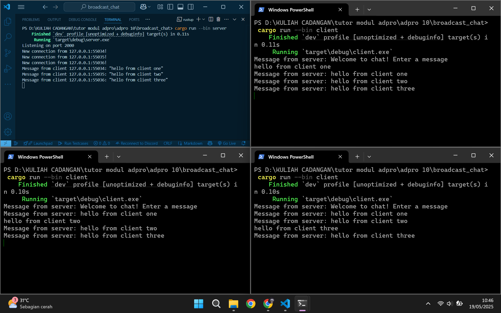
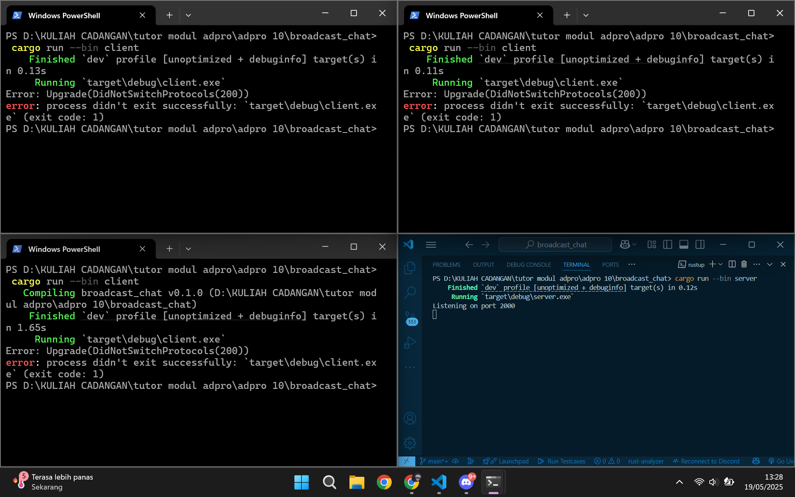
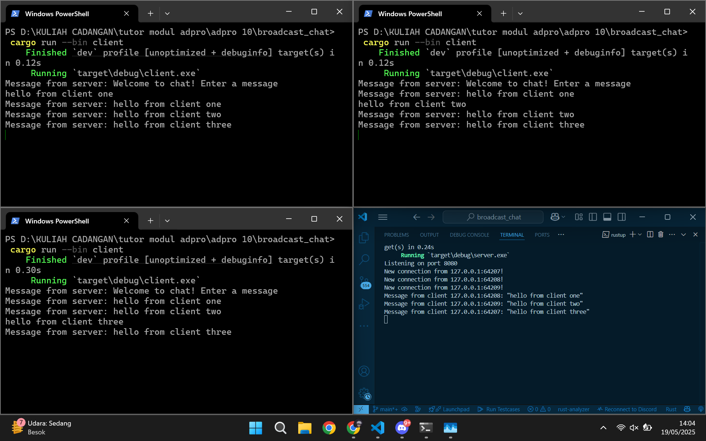

# Advprog Module 10 Tutorial Part 2 - Broadcast Chat
Hadyan Fachri\
2306245030\
Advprog A

# Reflection

Dari gambar di atas, setelah menjalankan satu server dan tiga client, dapat disimpulkan bahwa client hanya dapat berjalan jika server sudah dijalankan terlebih dahulu, karena client perlu terhubung ke endpoint WebSocket yang disediakan oleh server. Ketika salah satu client mengirimkan pesan, pesan tersebut akan diterima oleh server, lalu server akan membroadcast pesan tersebut ke semua client yang sedang terhubung, termasuk client pengirim jika masih aktif. 

Hal ini dimungkinkan karena setiap client yang berhasil terhubung akan otomatis menjadi subscriber pada channel broadcast yang dikelola oleh server. Meskipun server tidak menyimpan daftar client secara eksplisit, pesan yang dikirim melalui channel akan diterima oleh semua client yang masih terhubung. Dengan demikian, server berperan sebagai perantara yang menerima pesan dari client dan menyebarkannya kembali ke semua client lainnya.

Pada gambar di atas, terlihat bahwa port yang digunakan oleh client dan server berbeda, di mana server menunggu koneksi pada port `2000`, sedangkan client mencoba menghubungi WebSocket yang berjalan pada port `8080`. Karena tidak ada server WebSocket yang aktif di port `8080`, client mengalami error `Upgrade(DidNotSwitchProtocols(200))`. Error ini menunjukkan bahwa client berhasil menghubungi server HTTP pada port tersebut, namun server tersebut tidak melakukan upgrade ke protokol WebSocket sebagaimana yang diharapkan oleh client. Hal ini menandakan bahwa meskipun koneksi TCP berhasil dilakukan, komunikasi WebSocket tidak dapat dilanjutkan karena tidak ada layanan WebSocket yang sesuai pada port tersebut.

Setelah port server diubah dari `2000` menjadi `8080`, client kembali dapat terhubung ke server seperti sebelumnya. Perlu dipahami bahwa meskipun client langsung menggunakan protokol WebSocket untuk melakukan koneksi, server awalnya hanya mendengarkan koneksi TCP di port `8080`. Koneksi tersebut kemudian diproses dan di-upgrade ke protokol WebSocket melalui kode, sehingga komunikasi dua arah berbasis WebSocket dapat terjadi antara client dan server.